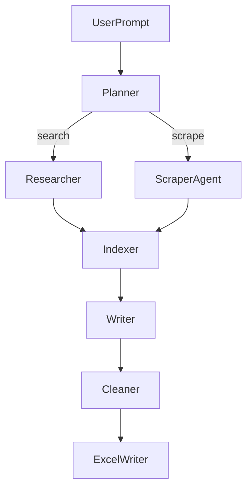

````markdown
# AGENTS.md – Role Catalogue & Schemas

This document enumerates every autonomous component in *Directed Deep Research* (DDR). Use it as the **single source of truth** when adding, refactoring, or debugging an agent.

---

## Core Principles

1. **Context is King**: Always include necessary documentation, examples, and caveats.  
2. **Validation Loops**: Provide executable tests or lint checks the AI can run and fix.  
3. **Information Dense**: Surface key patterns and keywords from the codebase.

---

## Documentation & References

```yaml
# MUST-READ resources to seed each agent’s context window
- url: https://ai.pydantic.dev/agents/
  why: Core agent creation patterns with Pydantic  
- url: https://ai.pydantic.dev/multi-agent-applications/
  why: Multi-agent system patterns, especially “agent-as-tool”  
- url: https://docs.tavily.com/documentation/about
  why: Tavily Search API REST endpoints  
- file: examples/agent/agent.py
  why: Pattern for agent creation, tool registration, dependencies  
- file: examples/agent/providers.py
  why: Multi-provider LLM configuration pattern  
````

---

## 0 Quick Table

| Agent                  | Responsibility                                   | Default LLM                     | Tool Access                  | Input Schema    | Output Schema          |
| ---------------------- | ------------------------------------------------ | ------------------------------- | ---------------------------- | --------------- | ---------------------- |
| **Planner**            | Break user prompt into sections & retrieval plan | `llama-3.3-70b-versatile`       | `tavily_search`, `crawl_url` | `TopicPrompt`   | `PlanJson`             |
| **Researcher**         | Answer one section via surface-level search      | `deepseek-r1-distill-llama-70b` | `tavily_search`              | `SectionTask`   | `SectionDraft`         |
| **ScraperAgent**       | Directed crawl of a specific URL → Markdown      | `deepseek-r1-distill-llama-70b` | `crawl_url`                  | `ScrapeRequest` | `ScrapeResult`         |
| **Indexer / RAG**      | Chunk, embed & similarity search                 | – (Python)                      | internal                     | `MarkdownDocs`  | `ContextDocs`          |
| **Writer**             | Compose intro, body & conclusion                 | `llama-3.3-70b-versatile`       | none                         | `CleanSections` | `MarkdownReport`       |
| **Cleaner / Exporter** | Extract numeric data & write Excel               | – (Python)                      | `pandas`, `openpyxl`         | `RawFacts`      | `research_report.xlsx` |

---

## 1 Planner

* **Goal:** Parse the user’s topic into a JSON plan with section titles, objectives, and retrieval method (`search` or `scrape`).
* **Model:** Groq `llama-3.3-70b-versatile`, `temperature=0`, `top_p=0.9`.
* **Schemas:**

  ```python
  class PlanSection(BaseModel):
      title: str
      objective: str
      retrieval: Literal["search", "scrape"]

  class PlanJson(BaseModel):
      sections: List[PlanSection]
  ```
* **Tools:** `tavily_search`, `crawl_url`
* **Routing Logic:**

  1. If `retrieval == "scrape"`, call **ScraperAgent** with the URL.
  2. Else, assign to **Researcher**.
* **Example:**

  ```python
  planner = ChatGroq(model="llama-3.3-70b-versatile") \
      .with_structured_output(PlanJson)
  plan = planner.invoke({"topic": "EU renewable energy subsidies 2010–2025"})
  ```

---

## 2 Researcher

* **Goal:** Produce a concise section draft using Tavily search and chain-of-thought reasoning.
* **Model:** Groq `deepseek-r1-distill-llama-70b`, `temperature=0.2`.
* **Tool:** `tavily_search(query: str) -> List[Document]`
  ([Tavily PyPI / docs](https://pypi.org/project/tavily/))
* **Prompt Skeleton:**

  ```
  System: You are an expert researcher. Think step-by-step and cite sources.
  User: {objective}
  ```
* **Implementation Example:**

  ```python
  @agent
  def researcher(task: SectionTask) -> SectionDraft:
      docs = tavily_search(task.objective)
      answer = llm_small.invoke({
          "context": docs,
          "question": task.objective
      })
      return SectionDraft(
          markdown=answer.content,
          sources=[d.url for d in docs]
      )
  ```

---

## 3 ScraperAgent

* **Goal:** Perform a directed crawl on a given URL and return clean Markdown.
* **Model:** Groq `deepseek-r1-distill-llama-70b`
* **Tool Definition:**

  ```python
  from crawl4ai import AsyncWebCrawler

  @tool
  async def crawl_url(url: str) -> str:
      async with AsyncWebCrawler() as crawler:
          return (await crawler.arun(url=url)).markdown
  ```

  ([Crawl4AI GitHub repo](https://github.com/unclecode/crawl4ai))

---

## 4 Indexer / RAG

* **Goal:** Chunk Markdown documents, embed them, and perform similarity searches at query time.
* **Snippet:**

  ```python
  from langchain.text_splitter import RecursiveCharacterTextSplitter
  from langchain.vectorstores import Chroma

  splitter = RecursiveCharacterTextSplitter(chunk_size=1000)
  docs = splitter.split_documents(raw_markdown)
  vector_store = Chroma.from_documents(
      docs, embedding=emb_model
  )

  def query_rag(question: str):
      return vector_store.similarity_search(question, k=4)
  ```

  ([LangChain Chroma integration docs](https://python.langchain.com/docs/integrations/vectorstores/chroma))

---

## 5 Writer

* **Goal:** Assemble the final report’s introduction, body, and conclusion in a cohesive Markdown document.
* **Model:** Groq `llama-3.3-70b-versatile`, `temperature=0.3`.
* **Prompt:**

  ```
  You are a senior analyst. Using the provided sections, write an academic-style introduction and conclusion. Embed markdown citations.
  ```

---

## 6 Cleaner / Exporter

* **Goal:** Extract structured numeric tables from cleaned content and export both data and narrative to an Excel workbook.
* **Snippet:**

  ```python
  def extract_numeric_tables(sections: List[str]) -> pd.DataFrame:
      all_tables = []
      for s in sections:
          tables = pd.read_html(s)
          all_tables.extend(tables)
      df = pd.concat(all_tables, ignore_index=True)
      df = df.apply(lambda col: pd.to_numeric(col, errors="ignore"))
      return df.drop_duplicates()

  # Export
  with pd.ExcelWriter('research_report.xlsx') as writer:
      num_df = extract_numeric_tables(clean_sections)
      num_df.to_excel(writer, sheet_name='data_numeric', index=False)
      pd.DataFrame({'report_md': [full_markdown]}) \
          .to_excel(writer, sheet_name='report_md', index=False)
  ```

  * `pd.read_html` docs: [https://pandas.pydata.org/docs/reference/api/pandas.read\_html.html](https://pandas.pydata.org/docs/reference/api/pandas.read_html.html)
  * `DataFrame.to_excel` docs: [https://pandas.pydata.org/docs/reference/api/pandas.DataFrame.to\_excel.html](https://pandas.pydata.org/docs/reference/api/pandas.DataFrame.to_excel.html)

---

## 7 Execution Graph



---

## 8 Concurrency

* **ScraperAgent** runs in parallel using LangGraph’s async support (`asyncio.gather`).
* **Planner**, **Writer**, and **Cleaner** execute once per request.

---

## 9 Environment Variable Matrix

| Agent              | `GROQ_API_KEY` | `TAVILY_API_KEY` | `PLAYWRIGHT_BROWSERS_PATH` |
| ------------------ | -------------- | ---------------- | -------------------------- |
| Planner            | ✅              | ✅                | ❌                          |
| Researcher         | ✅              | ✅                | ❌                          |
| ScraperAgent       | ✅              | ❌                | ✅                          |
| Writer             | ✅              | ❌                | ❌                          |
| Cleaner / Exporter | ❌              | ❌                | ❌                          |

```
```
