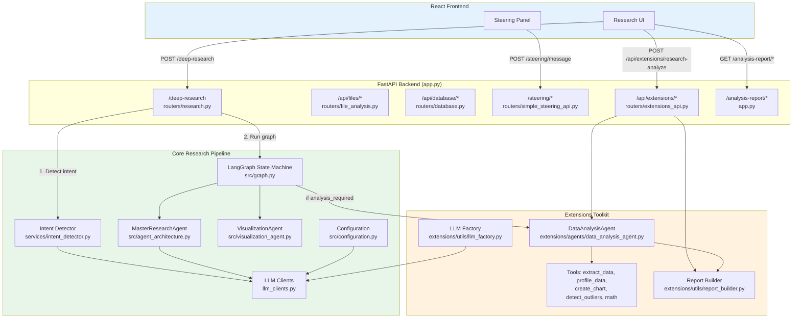
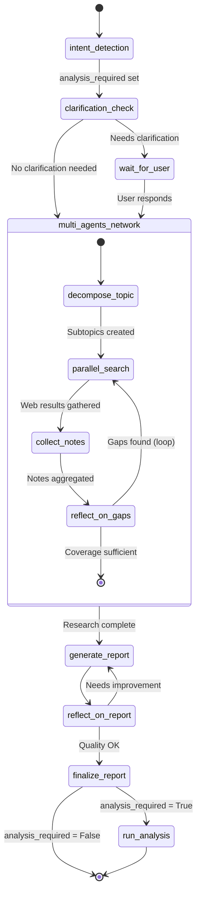
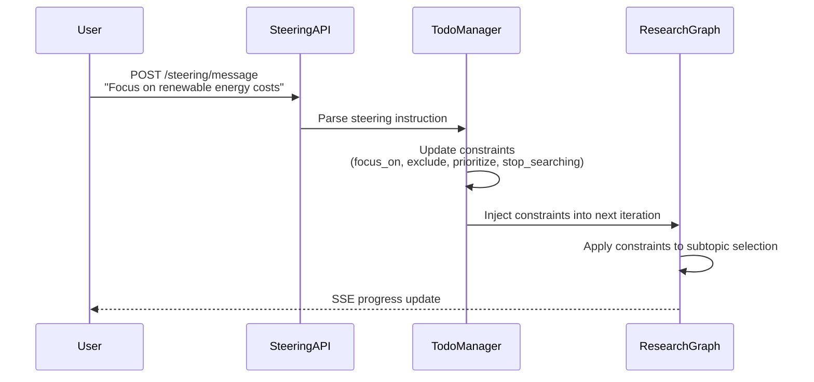
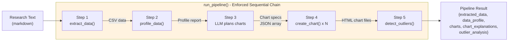
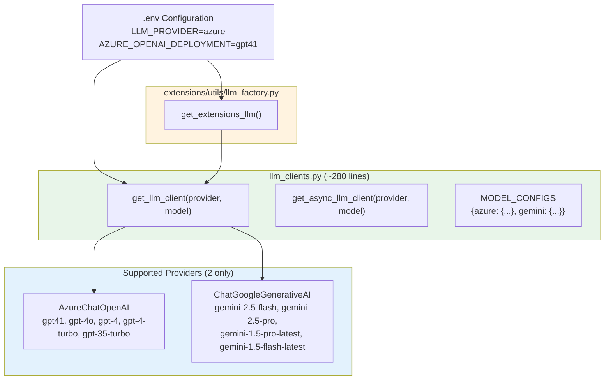
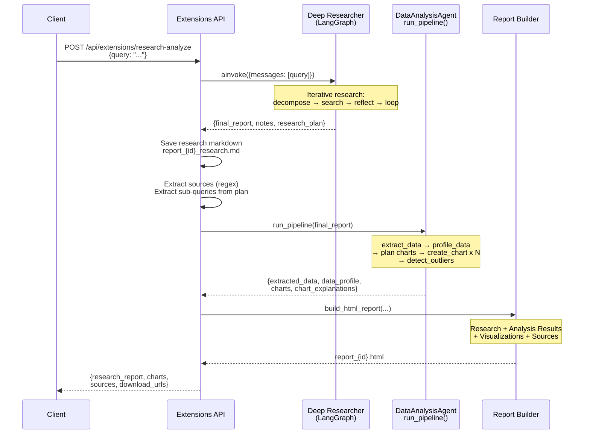
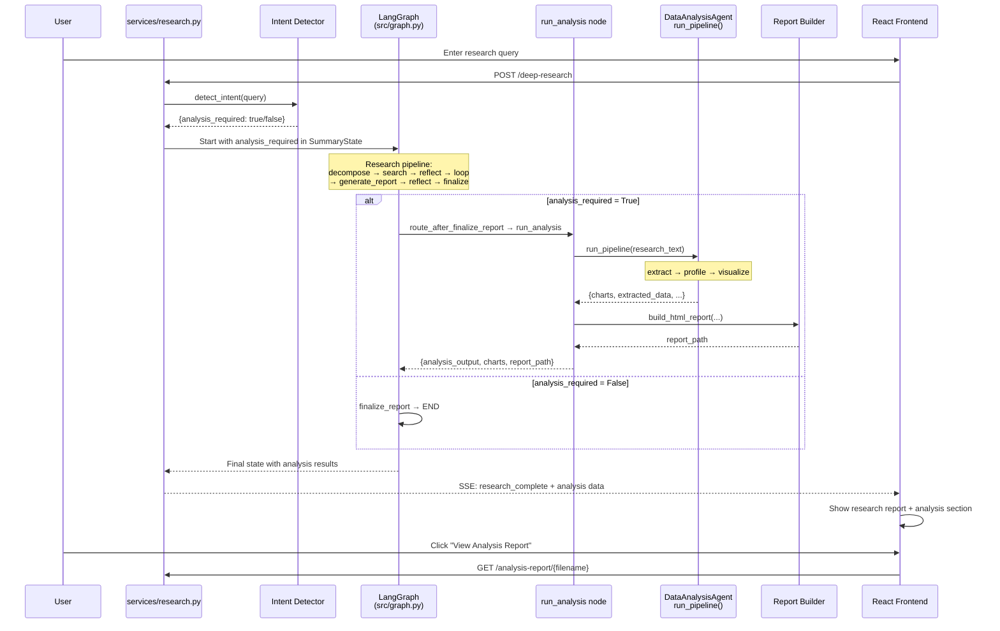
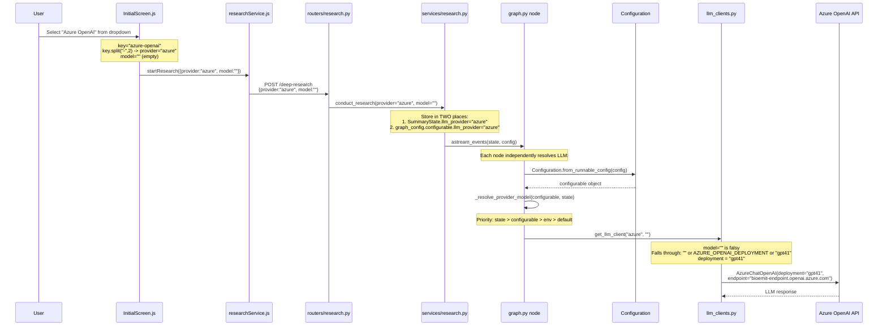

# Architecture Documentation

Enterprise Deep Research is a LangGraph-based multi-agent system that performs iterative deep research using LLMs and web search, with optional data analysis and visualization extensions.

---

## 1. System Overview



### Components

| Layer | Component | Purpose |
|-------|-----------|---------|
| **Frontend** | React App | Research UI with real-time streaming, steering panel, analysis report display |
| **Backend** | FastAPI + SSE | REST API with server-sent events for progress streaming |
| **Intent Detection** | Intent Detector | LLM-based classifier that determines if a query needs analysis/visualization |
| **Core Pipeline** | LangGraph State Machine | Iterative multi-agent research (search, reflect, gap-fill) with conditional analysis |
| **Extensions** | Data Analysis Toolkit | Extract data, profile, visualize, generate reports |
| **LLM Layer** | Unified LLM Clients | Two-provider support: Azure OpenAI (default) and Gemini |

---

## 2. Deep Research Pipeline

The core pipeline is a LangGraph state machine defined in `src/graph.py`. It performs iterative research by decomposing topics into subtopics, searching the web, reflecting on gaps, and looping until sufficient coverage is achieved.



> **Note:** `intent_detection` runs in `services/research.py` *before* the graph starts and sets `analysis_required` on `SummaryState`. The conditional edge after `finalize_report` reads this field to decide whether to run the analysis pipeline.

### Key State Fields

| Field | Type | Description |
|-------|------|-------------|
| `messages` | List[AnyMessage] | Conversation history |
| `research_plan` | dict | Subtopics, strategies, constraints |
| `notes` | List[str] | Research notes from web searches |
| `final_report` | str | Generated markdown report |
| `loop_count` | int | Current iteration (max from `MAX_WEB_RESEARCH_LOOPS`) |
| `llm_provider` | Optional[str] | LLM provider selected by user (`"azure"` or `"gemini"`) |
| `llm_model` | Optional[str] | Specific model name (e.g., `""` for Azure default, `"gemini-2.5-flash"`) |
| `analysis_required` | bool | Whether user requested data analysis (set by intent detector) |
| `analysis_output` | Optional[str] | Analysis text summary from pipeline |
| `analysis_report_path` | Optional[str] | Path to generated HTML analysis report |
| `analysis_charts` | List[str] | List of chart file paths |
| `analysis_chart_explanations` | Dict[str, Any] | Chart metadata and descriptions |

### Research Flow Detail

1. **Intent Detection**: `services/intent_detector.py` classifies the query as research-only or research+analysis. Sets `analysis_required` on `SummaryState`.
2. **Topic Decomposition**: `MasterResearchAgent` breaks query into 3-5 focused subtopics
3. **Parallel Search**: Each subtopic searched concurrently via Tavily/web search
4. **Note Collection**: Results aggregated, deduplicated
5. **Gap Reflection**: LLM identifies missing information, generates follow-up queries
6. **Iterative Loop**: Steps 3-5 repeat until coverage is sufficient or max loops reached
7. **Report Generation**: LLM synthesizes all notes into structured markdown report
8. **Report Reflection**: Quality check - loops back if report needs improvement
9. **Finalization**: Final report output with DATA section containing markdown tables
10. **Conditional Analysis**: If `analysis_required=True`, the `run_analysis` node extracts data from the report, profiles it, generates interactive Plotly charts, and builds an HTML analysis report

---

## 3. Steering System

The steering system enables human-in-the-loop research direction control. Users can guide the research while it's running.



### Steering Commands

| Command | Effect | Example |
|---------|--------|---------|
| `focus_on` | Prioritize specific aspect | "Focus on economic impact" |
| `exclude` | Skip certain topics | "Don't include political aspects" |
| `prioritize` | Reorder subtopics | "Prioritize recent 2024 data" |
| `stop_searching` | End research early | "That's enough, generate report" |

The steering state is managed by `ResearchTodoManager` and injected into the LangGraph state between iterations.

---

## 4. Extensions: Enforced Tool Chain

The extensions data analysis pipeline uses an enforced sequential chain rather than relying on LLM tool selection. This ensures data is always extracted before profiling, and profiling happens before visualization.



### Pipeline Steps

| Step | Tool | Input | Output |
|------|------|-------|--------|
| 1 | `extract_data()` | Research text | CSV data |
| 2 | `profile_data()` | CSV data | Statistics, distributions, column types |
| 3 | LLM (structured) | CSV + Profile | JSON array of chart specs |
| 4 | `create_chart()` | CSV + chart spec | Plotly HTML files in `outputs/charts/` |
| 5 | `detect_outliers()` | CSV + numeric column | Outlier analysis + optional chart |

### Logging Format

All pipeline steps log with `[PIPELINE]` prefix:
```
[PIPELINE] Step 1/5: Extracting data from research material...
[PIPELINE] Step 1/5: Extracted 45 rows, 6 columns (2.3s)
[PIPELINE] Step 2/5: Profiling extracted data...
[PIPELINE] Step 3/5: Planning visualizations...
[PIPELINE] Step 3/5: Planned 3 charts: bar, line, pie (1.1s)
[PIPELINE] Step 4/5: Creating chart 1/3 (bar)...
[PIPELINE] Step 4/5: Chart saved: outputs/charts/bar_a1b2c3d4.html
[PIPELINE] Step 5/5: Outlier detection skipped (insufficient data)
[PIPELINE] Complete: 3 charts, outliers=no, 12.3s
```

Graph node logs with `[node_name]` prefix:
```
[run_analysis] Running pipeline on 12000 chars of research text
[generate_report] LLM resolved -> provider=azure, model=gpt41
[refine_query] LLM resolved -> provider=azure, model=gpt41
```

---

## 5. LLM Provider Architecture

All LLM access goes through a unified factory in `llm_clients.py` (~280 lines). The system supports exactly **two providers**: Azure OpenAI (default) and Gemini. The extensions use `extensions/utils/llm_factory.py` which delegates to the same factory, ensuring one model is used everywhere.

> **Note:** In a previous version, 8 providers were supported (OpenAI, Anthropic, Groq, Mistral, HuggingFace, Ollama, SFR Gateway, SambaNova). These were removed to simplify the codebase and reduce maintenance overhead. Only Azure OpenAI and Gemini remain.



### Provider Configuration

| Provider | Env Keys | Default Model | Auth |
|----------|----------|---------------|------|
| `azure` (default) | `AZURE_OPENAI_API_KEY`, `AZURE_OPENAI_ENDPOINT`, `AZURE_OPENAI_DEPLOYMENT`, `AZURE_OPENAI_API_VERSION` | `gpt41` (from `AZURE_OPENAI_DEPLOYMENT` env var) | API Key + Endpoint |
| `gemini` | `GEMINI_API_KEY` | `gemini-2.5-flash` | API Key |

### Removed Providers

The following providers were completely removed from `llm_clients.py`, `configuration.py`, frontend, and `.env`:

| Removed Provider | Removed Classes/Imports |
|-----------------|------------------------|
| OpenAI | `ChatOpenAI`, `SimpleOpenAIClient`, `ReasoningEffortOpenAIClient` |
| Anthropic | `ChatAnthropic`, `Claude3ExtendedClient` |
| Groq | `ChatGroq` |
| Mistral | `ChatMistralAI` |
| HuggingFace | `ChatHuggingFace` |
| Ollama | `ChatOllama` |
| SFR Gateway | `SalesforceResearchClient` |
| SambaNova | `SambNovaClient` |

### No Fallback Mechanism

If Azure OpenAI fails (e.g., connection error, invalid API key), the error propagates directly. There is **no automatic fallback** to Gemini. The `get_llm_client()` function raises a `ValueError` for any unsupported provider.

---

## 6. API Endpoints

### Core Research

| Method | Endpoint | Description |
|--------|----------|-------------|
| POST | `/deep-research` | Run deep research with optional streaming and steering |
| POST | `/steering/message` | Send steering message during research |
| GET | `/steering/plan/{session_id}` | Get current research plan |
| GET | `/analysis-report/{filename}` | Serve generated analysis report HTML files |

### File Analysis

| Method | Endpoint | Description |
|--------|----------|-------------|
| POST | `/api/files/upload` | Upload and analyze files |
| GET | `/api/files/{file_id}/analysis` | Get file analysis results |

### Database (Text2SQL)

| Method | Endpoint | Description |
|--------|----------|-------------|
| POST | `/api/database/upload` | Upload database for text2sql |
| GET | `/api/database/list` | List uploaded databases |
| GET | `/api/database/{id}/schema` | Get database schema |
| POST | `/api/database/query` | Execute text2sql query |
| DELETE | `/api/database/{id}` | Delete uploaded database |

### Extensions (Data Analysis)

| Method | Endpoint | Description |
|--------|----------|-------------|
| POST | `/api/extensions/analyze` | Run analysis pipeline on provided data |
| POST | `/api/extensions/research-analyze` | Deep research + analysis pipeline + HTML report |
| GET | `/api/extensions/charts/{filename}` | Serve chart HTML file |
| GET | `/api/extensions/reports/{filename}` | Serve HTML report file |
| GET | `/api/extensions/download/{id}/research` | Download research markdown |
| GET | `/api/extensions/download/{id}/analysis` | Download analysis HTML |

---

## 7. Tools Inventory

| Tool | Location | Purpose |
|------|----------|---------|
| `extract_data` | `extensions/tools/data_extraction.py` | Extract structured CSV/JSON from text |
| `profile_data` | `extensions/tools/data_profiling.py` | Analyze data distributions, types, statistics |
| `create_chart` | `extensions/tools/visualization.py` | Create Plotly interactive HTML charts |
| `detect_outliers` | `extensions/tools/visualization.py` | IQR, Z-score, Isolation Forest outlier detection |
| `add/subtract/multiply/divide` | `extensions/tools/math_tools.py` | Basic math operations |
| `calculate` | `extensions/tools/math_tools.py` | Expression evaluation |

### Chart Types

| Type | Best For |
|------|----------|
| `bar` | Category comparisons |
| `line` | Trends over time |
| `pie` | Proportions / distributions |
| `scatter` | Correlations |
| `histogram` | Single variable distribution |
| `box` | Quartile / outlier visualization |
| `violin` | Distribution shape |
| `heatmap` | Multi-variable correlation |
| `bubble` | 3-variable relationships |
| `density` | Probability density |

---

## 8. File Output Conventions

| Type | Path Pattern | Format |
|------|-------------|--------|
| Charts | `outputs/charts/{chart_type}_{uuid8}.html` | Plotly HTML |
| Analysis Report | `outputs/reports/report_{uuid8}.html` | Styled HTML |
| Research Report | `outputs/reports/report_{uuid8}_research.md` | Markdown |

---

## 9. Combined Research + Analysis Flow

The `/api/extensions/research-analyze` endpoint combines both pipelines:



---

## 10. Intent Detection + Integrated Analysis Pipeline

The primary `/deep-research` endpoint now includes automatic intent detection and conditional analysis. This is the main flow for end-users via the React frontend.



### Key Design Decisions

| Decision | Rationale |
|----------|-----------|
| Intent detection runs **before** the graph | Avoids modifying graph internals; result stored in state field |
| Single boolean `analysis_required` | Simplest possible interface — analysis and visualization are always coupled |
| Safe fallback to `False` | Any intent detection error → research still runs, no analysis |
| Analysis node is a **graph node**, not external | Runs inside LangGraph state machine, can access all state fields |
| Conditional edge (not always-run) | Saves time/cost when user only wants research |

### SSE Event Flow

| Event | When | Data |
|-------|------|------|
| `research_started` | Graph begins | Session info |
| `search_started` / `search_complete` | Each web search | Query, results count |
| `report_generated` | Draft report ready | Report text |
| `analysis_started` | Analysis pipeline begins | — |
| `analysis_complete` | Analysis done | Charts, report path |
| `research_complete` | Everything done | Full results + analysis data |

---

## 11. LLM Model Selection Flow

The model selection flows from frontend dropdown through to the actual API call:



### Key Design Points

| Aspect | Implementation |
|--------|---------------|
| **Frontend model key** | `"azure-openai"` splits to provider `"azure"`, model `""` |
| **Empty model string** | Falls through `or` chain in `get_llm_client()` to use `AZURE_OPENAI_DEPLOYMENT` from `.env` |
| **Dual storage** | Provider/model stored in both `SummaryState` and `graph_config.configurable` |
| **Per-node resolution** | Every graph node calls `_resolve_provider_model()` independently |
| **Priority order** | `state.llm_provider` > `configurable.llm_provider` > env `LLM_PROVIDER` > default `"azure"` |
| **No fallback** | If Azure fails, error propagates — no automatic switch to Gemini |

### Configuration Enum

```python
class LLMProvider(Enum):
    AZURE = "azure"    # Default
    GEMINI = "gemini"
```

### .env Configuration

```env
LLM_PROVIDER=azure
AZURE_OPENAI_API_KEY=<key>
AZURE_OPENAI_ENDPOINT=https://bioemit-endpoint.openai.azure.com/
AZURE_OPENAI_DEPLOYMENT=gpt41
AZURE_OPENAI_API_VERSION=2024-12-01-preview
GEMINI_API_KEY=<key>
ACTIVITY_LLM_PROVIDER=azure
ACTIVITY_LLM_MODEL=gpt41
```
